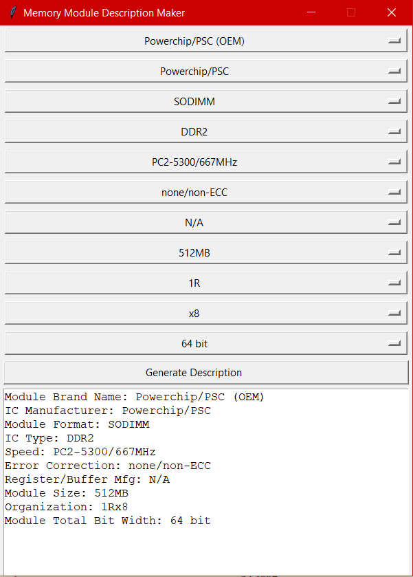

# memdesmaker
Python app for making descriptions of computer memory modules

Example (on Windows 10):

Would be a description of this memory module:

Instructions:
1. Select options from dropdown menus
2. Press "Generate Description"
3. Copy from the text box

Idea originally came up when coming up with descriptions for an Instagram account that posts about computer memory modules. This program can also be used in inventory management and e-commerce websites.

All trademarks and logos in the app, images and this file are property of their respective owners
